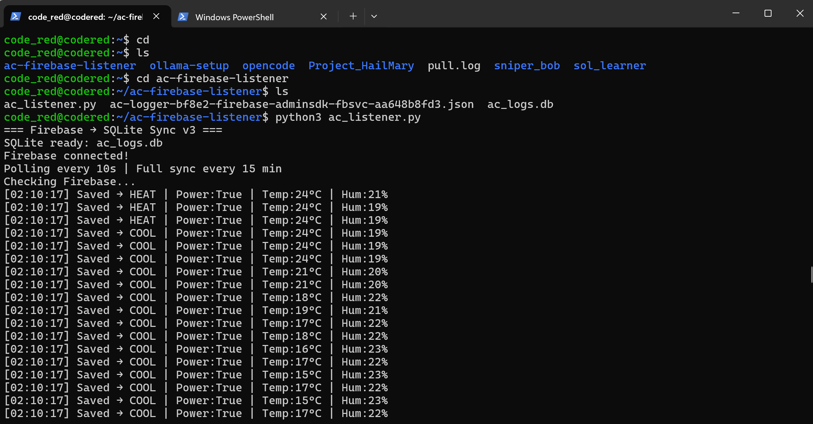

# AC Behaviour Automation


## The problem

From my teenage years, I spent 15–30 minutes every single day adjusting my AC remote — changing modes, toggling eco and powerful settings, adjusting temperature. It was a habit I never managed to break. So I decided to build a system that learns my behaviour and automates the AC on its own.


## How it works

```
Custom remote (Wemos D1) → IR blaster → Mitsubishi Heavy AC
        ↓
Button press + DHT11 sensor
        ↓
Firebase Realtime Database
        ↓
Python sync script → SQLite database
        ↓
Pattern recognition model → Autonomous AC control
```

## Hardware

| Component | Purpose |
|---|---|
| Wemos D1 Mini (ESP8266) | Main controller |
| IR LED + 2N2222 transistor | IR blaster circuit |
| DHT11 | Room temperature + humidity |
| 3x push buttons | ON/OFF, mode (cool/heat), eco/powerful |
| Green + Red LEDs | Mode indicators |
| 9V battery + barrel jack | Wireless power |

## Button behaviour

| Button | Action |
|---|---|
| BTN 1 | Toggle AC ON / OFF |
| BTN 2 | Toggle Cool ↔ Heat |
| BTN 3 | Cycle Normal → Eco → Powerful |

## LED indicators

| LED | Blinks | Meaning |
|---|---|---|
| Green | 1 | Cool mode |
| Green | 2 | Eco mode |
| Red | 1 | Heat mode |
| Red | 2 | Powerful mode |

## Data logged per event

Every button press and every 15 minutes, the following is pushed to Firebase and synced to SQLite:

```json
{
  "power": true,
  "mode": "COOL",
  "eco": false,
  "powerful": false,
  "temp_set": 24,
  "temp_room": 21.5,
  "humidity": 55,
  "timestamp": 123456
}
```

## Repository structure

```
ac_remote_logger/
  ac_remote_logger_final.ino   ← Arduino sketch (IR blaster + buttons + DHT11 + Firebase)
firebase_to_sqlite_v2.py       ← Syncs Firebase → SQLite in real time + every 15 mins
convert_db_to_csv.py           ← Exports SQLite to CSV for analysis
ac_logs.db                     ← SQLite database — all recorded behaviour
ac_logs.csv                    ← CSV export — 1000+ rows of behaviour data
firebase_sdk_Example.json      ← Firebase config template (no real credentials)
```

## Setup

### Arduino (Wemos D1 Mini)

1. Install libraries in Arduino IDE:
   - `IRremoteESP8266` by crankyoldgit
   - `Firebase Arduino Client Library` by Mobizt
   - `DHT sensor library` by Adafruit

2. Fill in credentials in `ac_remote_logger_final.ino`:
```cpp
#define WIFI_SSID     "your_wifi"
#define WIFI_PASSWORD "your_password"
#define API_KEY       "your_firebase_api_key"
#define DATABASE_URL  "https://your-project.firebasedatabase.app"
```

3. Flash to Wemos D1 Mini

### Python sync script

```bash
pip install firebase-admin pandas
python firebase_to_sqlite_v2.py
```

### Export to CSV

```bash
python convert_db_to_csv.py
```

## Roadmap

### - [x] Custom IR remote simulator on Wemos D1


      
- [x] Firebase Realtime Database integration
      

      
- [x] SQLite sync script (real-time + 15-min polling)
      


- [x] 1000+ rows of behaviour data collected
      


#- [x] Pattern recognition model on behaviour data

      ### Feature Engineering

Three raw features are transformed before training:

- **`hour_sin` / `hour_cos`** — Circular encoding of the hour-of-day so that midnight and 11pm are numerically close:
  ```python
  hour_sin = sin(2π × hour / 24)
  hour_cos = cos(2π × hour / 24)
  ```
- **`temp_change`** — Difference between the previous and current room temperature, capturing warming/cooling trends.

Final feature vector: `[temp_room, humidity, hour_sin, hour_cos, temp_change]`

---

### Model Architecture — Hierarchical Random Forest

Six `RandomForestClassifier` models are trained in a two-level hierarchy that mirrors how a person actually decides AC settings:

```
Sensor Input (temp, humidity, hour)
        │
        ▼
┌───────────────┐
│  Mode Model   │  → HEAT (0)  or  COOL (1)
└───────────────┘
        │
   ┌────┴────┐
   ▼         ▼
 HEAT       COOL
 ┌──────┐  ┌──────┐   eco_model_heat / eco_model_cool
 └──────┘  └──────┘   powerful_model_heat / powerful_model_cool
```

Each model in `ac_models_v2/` is persisted with `joblib`:

| File | Predicts |
|---|---|
| `mode_model.pkl` | HEAT vs COOL |
| `eco_model_heat.pkl` | Eco ON/OFF when mode = HEAT |
| `eco_model_cool.pkl` | Eco ON/OFF when mode = COOL |
| `powerful_model_heat.pkl` | Turbo ON/OFF when mode = HEAT |
| `powerful_model_cool.pkl` | Turbo ON/OFF when mode = COOL |
| `metadata.pkl` | Feature columns, model version |

Training used `TimeSeriesSplit` validation to respect temporal ordering and prevent data leakage from future behaviour into past predictions.

---

### Feature Importance

Temperature and time of day dominate every model. `hour_sin` is the strongest signal for mode selection (0.62), while `temp_room` drives eco and powerful decisions (0.33–0.35).


---

### Model Performance

| Model | Accuracy |
|---|---|
| Mode (HEAT/COOL) | **100%** |
| Eco | **~91%** |
| Powerful | **~91%** |

The mode model achieves perfect separation because HEAT and COOL usage has a near-perfect correlation with hour-of-day in this household. Eco and powerful predictions carry a small error margin where ambiguous temperature ranges exist.


---

### Learned Patterns

The models captured clear temporal and temperature-driven behaviour:

- **Morning (6am–10am):** COOL mode when `temp_room > 25°C`; eco ON
- **Afternoon (12pm–5pm):** COOL with powerful ON at higher temps
- **Evening / Night:** HEAT more likely; eco preference rises
- **Low temp + high humidity:** Powerful mode triggered


---

## Deploy Model for Fully Autonomous AC Control

### Inference Daemon — `inference_worker.py`

A Python daemon runs on a home server, polling every **10 minutes**. No user input required after deployment.

**Full autonomous pipeline:**

```
Every 10 minutes
       │
       ▼
1. Fetch latest 2 sensor readings from Firebase /sensor_logs/
   └── Extract: temp_room, humidity, previous_temp, timestamp
       │
       ▼
2. Feature engineering
   └── hour_sin, hour_cos from timestamp
   └── temp_change = prev_temp - current_temp
       │
       ▼
3. Load models from ac_models_v2/ (joblib)
       │
       ▼
4. Hierarchical inference
   ├── mode_model.predict(features)      → HEAT or COOL
   └── eco/powerful models (mode-gated)  → ON or OFF
       │
       ▼
5. Push prediction to Firebase /commands/
   └── { mode, eco, powerful, confidence, timestamp }
       │
       ▼
6. ESP8266 polls /commands/
   └── Fires IR signal to Mitsubishi AC (MITSUBISHI_HEAVY_152)
   └── Updates internal state + logs back to Firebase
```

---

### Authentication & Token Management

The worker authenticates to Firebase REST API using an API key and auto-refreshes its ID token every **55 minutes** to stay ahead of the 60-minute expiry — ensuring no dropped commands during long uptime sessions.

---

### Server Logging

Every inference cycle logs a full status line: timestamp, raw sensor values, predicted output, and model confidence.



---

### Predictions vs Actual Behaviour

After deployment, model predictions were compared against continued manual presses. The outputs track real user behaviour closely across all three outputs (mode, eco, powerful):


---

### End-to-End Latency

| Stage | Interval |
|---|---|
| Sensor log to Firebase | 15 min (auto) or on button press |
| Firebase → SQLite sync | 10 sec poll |
| Inference cycle | Every 10 min |
| Command → IR execution | < 1 sec after ESP8266 poll |
| **Total end-to-end** | **≤ 10–15 min** |

---

### Result

The AC now adjusts itself based on room conditions and time of day — no button presses needed. The system learned a consistent enough preference pattern (temp + hour) that Random Forest classifiers achieve 91–100% accuracy, making autonomous control reliable for daily use.

- [ ] Deploy model for fully autonomous AC control

## AC unit

Mitsubishi Heavy Industries — remote model `RLA502A700B`, protocol `MITSUBISHI_HEAVY_152`.

## Security note

Never commit your Firebase service account JSON or real credentials. The `firebase_sdk_Example.json` in this repo is a template only.
